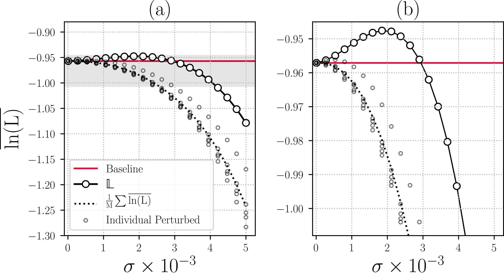

# PEP: Parameter Ensembling by Perturbation

This repository is the official implementation of **PEP: Parameter Ensembling by Perturbation.**

<!-- > 📋Optional: include a graphic explaining your approach/main result, bibtex entry, link to demos, blog posts and tutorials
-->

## Requirements

To install requirements:

```setup
pip install -r requirements.txt
```

## Project setup
1. Change the project root in the `helpers/settings.py` file to the directory that 
you want to run experiments.
2. Run `settings.py` file to create the folder structure for this project:
    ```
    cd helpers
    python settings.py
    ```
    which should create the following folder structure:
    ```
    ├── intermediate
    │   ├── data
    │   │   ├── arrays
    │   │   └── sheets
    │   └── models
    └── raw
    ```
3. Download the preprocessed ImageNet data (center cropped) that we used in this project from the 
following link:
[Download Link](https://www.dropbox.com/sh/5nwkk693coegsr4/AACRBvEV_1micL5bBnmbPydea?dl=0)

4. copy the folders imagenet_224 and imagenet_299 to the `[project_root]/intermediate/data/arrays/` folder.
These are numpy arrays containing 50,000 validation images from ILSVRC2012.
They are cropped and resized to sizes of 224 and 299 which are the sizes
to our the ImageNet pre-trained networks that we are going to use.

#### optional preprocessing
Optionally, instead of running steps 3 and 4 you can create these arrays
by runnin the code in `preprocessing` folder. 
First, you have to download the ILSVRC2012_devkit_t12
form ImageNet website, put the JPEG images in `[project_root]/raw/imagenet_validation/`
and then run the following codes for pre-processing:
```
cd preprocessing
python 1_resize_crop_images.py
python 2_preprocess_y_val.py
```
Running preporcessing code requires `OpenCV` installation:
```
pip install opencv
```
Installing opencv on latest versions of conda can be tricky, so 
we recommend to download the arrays (step 3 and 4 above) if you
could not install OpenCV.

## ImageNet Experiments
### Figure 1
To reproduce the effect of PEP on pre-trained inception-V3 (Figure 1 in
the manuscript), first run `1_perturb_inception.py` inside `ImageNet\1_figure1\`
```
cd Imagenet\1_figure1
python 1_pertrub_inception.py
```
Then open run jupyter notebook and run the cells inside `2_draw_chart.ipynb`.
The result is the following figure.


### Finding Optimal Sigmas

### PEP

### Analysis and comparison with Temperature Scaling

## MNIST Experiments

## CIFAR-10 Experiments

## Overfitting Experiments

